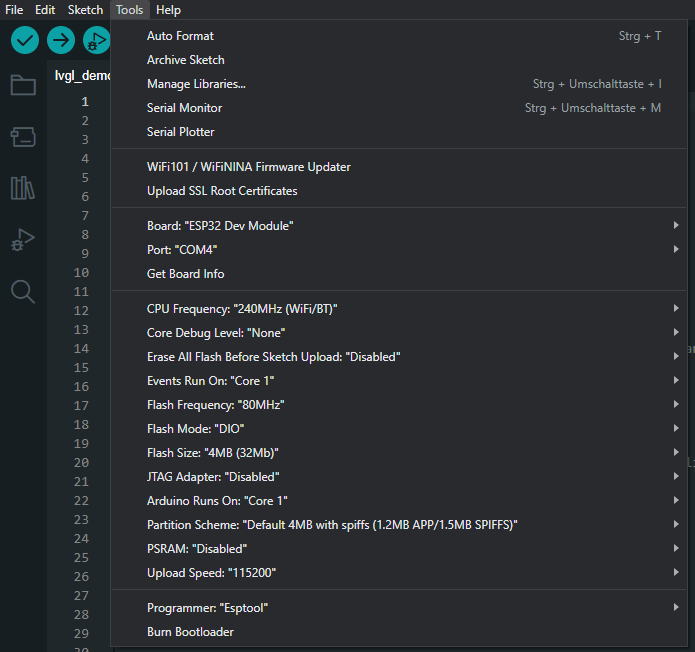

# 1. What is this?
This is my documentation on how to setup the development environment for the Sunton ESP32 2.8" TFT development board with a LVGL demo.

## 1.1. Versioning

### 1.1.1. Device
I've used the [ESP32 Development Board with a 2.8" TFT 240*320 Touch Display Screen](https://www.aliexpress.com/item/1005005616073472.html) from AliExpress (about 12€)

### 1.1.2. Development environment
| Name                           | Version
| -------------                  | ------------------
| Arduino IDE                    | 2.1.1
| Visual Studio Code _(optional)_  | 1.82.2

### 1.1.3. Libraries
| Name               | Version            | More
| -------------      | ------------------ | ---------
| TFT_eSPI           | 2.1.1              |
| lvgl               | 8.3.10             | [lvgl.io docs](https://docs.lvgl.io/master/index.html)
| TFT_Touch          | 02142af on Mar 11  | [Github](https://github.com/Bodmer/TFT_Touch)

See [3.2. Compile demo sketch](#32-compile-demo-sketch) for library versions

# 2. Repository structure

| Folder       | Description     |
| ------------ | --------------- |
| [assets/](./assets/) | A folder with files for this readme
| [setup/](./setup/) | A folder with files you need for the setup
| [references/](./references/) | A folder with documents used as a base to create this setup. Includes files from the manufacturer's manual

# 3. Steps

## 3.1. Setup environment
1. Download the Arduino IDE
2. Make sure you have an Arduino folder
   - On Windows, this is typically at %userprofile%\Documents\Arduino
   - There should also be a libraries folder inside
3. Install esp device family configuration
   - Open File > Preferences
   - Enter following link into "Additional boards manager URLs":
   - Link: https://raw.githubusercontent.com/espressif/arduino-esp32/gh-pages/package_esp32_index.json
   - If you have multiple URLs, separate them with commas
4. Setup board settings in Tools >
   1. Board: esp32 > ESP32 Dev Module
   2. Port: One of the COM ports
      - You can verify it by using `Tools > Get board info`. If a window opens, its probably correct
   3. CPU Frequency: 240MHZ [...]
   4. Events run on: Core 1
   5. Flash frequency: 80MHz
   6. Flash mode: DIO
   7. Flash size: 4MB
   8. Arduino runs on: Core 1
   9. Programmer: Esptool

A screenshot of the configuration:

## 3.2. Compile demo sketch
Have a look at the library version numbers in [1.3.3. Libraries](#113-libraries). Soon lgvl 9.0 will be released and there will probably be some API changes.

1. Open the demo sketch in setup/lvgl_demo/ in the Arduino IDE
2. Install libraries in Arduino IDE
   - TFT_eSPI by Bodmer
   - lvgl by kisvegabor
3. Install TFT_Touch library with git
   - `git clone https://github.com/Bodmer/TFT_Touch.git` into Arduino libraries folder
     - The library is not listed in the Arduino library repository but can be installed this way
4. Copy User_Setup.h into Arduino/libraries/TFT_eSPI folder
   - Notice how this is not done on project-, but on user-level
   - You might use the User_Setup_Select.h file to select for different projects
   - Check the config, so it matches your display
5. Copy lv_conf.h into Arduino/libraries folder
6. Verify and upload

# 4. Links

| Link      | Description     |
| --------- | --------------- |
| [LVGL Documentation](https://docs.lvgl.io/master/index.html) | Startpage of the LVGL documentation
| [LVGL Examples](https://docs.lvgl.io/master/examples.html#examples) | Page with demo code on how to use LVGL widgets
| [LovyanGFX](https://github.com/lovyan03/LovyanGFX) | Alternative faster graphics library to TFT_eSPI. I dont know how to use lvgl with it.
| [Macsbug blog](https://macsbug.wordpress.com/2022/08/17/esp32-2432s028/) | Blog entry about the esp32 board and comments about its features, architecture and flaws. Page is in chinese - but translated page can be found [here](./references/ESP32-2432S028_macsbug_en.pdf)
| [Makerfabs wiki](https://wiki.makerfabs.com/Sunton_ESP32_2.8_inch_240x320_TFT_with_Touch.html) | Wiki page about the board with specifications and another quickstart guide